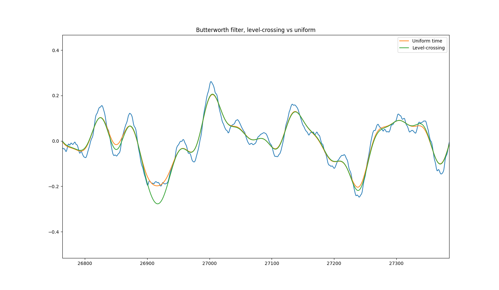

# A Level-Crossing Analog-to-Digital Converter for Musical Signals

The source code for the my thesis project. The final report can be found [here](https://zoo.cs.yale.edu/classes/cs490/23-24a/bobrow.ansel.ab3254/) (requires Yale SSO).

